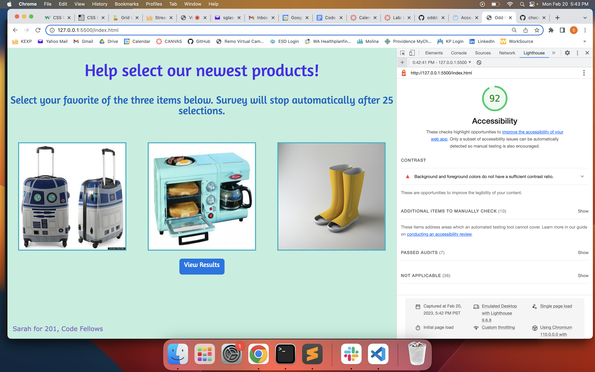

# 201 lab 11 - Odd Duck

## Author: Sarah Glass

## Description
Link to description can be found [here](https://codefellows.github.io/code-201-guide/curriculum/class-11/lab/).

## Links to Resources

Link for accessible color schemes: [https://venngage.com/tools/accessible-color-palette-generator#colorGenerator](https://venngage.com/tools/accessible-color-palette-generator#colorGenerator)

## Most Recent Screenshot of Lighthouse Accessibility Score

